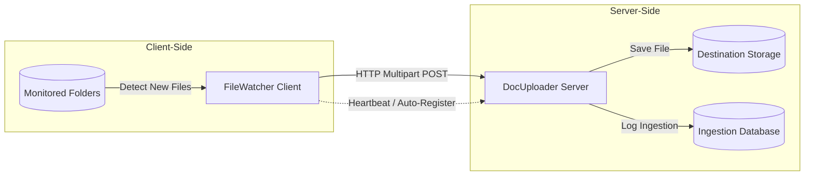
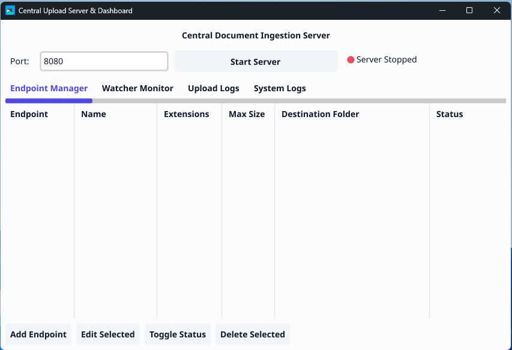
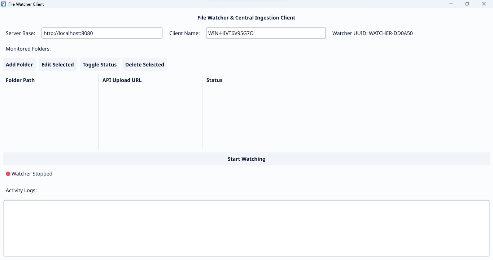

# DocUploader & FileWatcher

A premium, modern desktop-based document ingestion ecosystem built with Go and the Fyne UI framework. This repository contains both the **Central Upload Server & Dashboard** (DocUploader) and the **Local Folder Monitoring Client** (FileWatcher).

---

## 🌟 Overview / Ringkasan

This system is designed for laboratories, offices, and automated environments where documents generated by machines or users need to be automatically gathered and centralised.

Sistem ini dirancang untuk laboratorium, kantor, dan lingkungan otomatis di mana dokumen yang dihasilkan oleh mesin atau pengguna perlu dikumpulkan dan dipusatkan secara otomatis.



---

## 🚀 Key Features / Fitur Utama

### 📡 Central Upload Server (DocUploader)
* **Ingestion Endpoint Manager:** Define custom HTTP endpoints (e.g. `/upload/pebjf`) with specified allowed extensions, maximum file size, and custom directories.
* **Real-time Log Dashboard:** Watch files being received live in the logs table.
* **Client Monitoring:** Keep track of all active FileWatcher clients, their host IPs, and their online/offline statuses via an automated offline monitor.
* **Security Control:** Enforce optional Bearer Token authentication on a per-endpoint basis and block malicious execution MIME types (e.g., `.exe`, `.dll`).

### 📂 Folder Monitoring Client (FileWatcher)
* **Multi-folder Monitoring:** Watch multiple local directories simultaneously.
* **Autonomous Stability Verification:** Ensures files are completely written to disk before attempting to upload.
* **Self-Healing retry loop:** Scans monitored paths on startup and periodically to ingest unsent files that were written while offline.
* **Automatic Deletion:** Automatically purges the local file upon successful ingestion to avoid duplication.
* **Automatic Server Registration:** Auto-registers watched paths with the Central Server for easy management and reporting.

---

## 🎨 Premium Modern UI / Tampilan Antarmuka Modern
Both applications are styled using our premium **Modern Slate Theme**, featuring gorgeous slate background gradients, vivid indigo highlights, responsive sizing, and high-readability custom typography that supports both Dark Mode and Light Mode.

Kedua aplikasi menggunakan **Modern Slate Theme** yang sangat elegan, dengan latar belakang slate, highlight indigo yang cerah, dan tipografi kustom yang mendukung Mode Gelap (Dark Mode) maupun Mode Terang (Light Mode).

### DocUploader Server & Dashboard


### FileWatcher Client


---

## 🛠️ Build & Installation / Kompilasi & Instalasi

### Prerequisites
* Go compiler installed (version 1.25.6 or newer recommended)
* A C compiler (like GCC or MinGW on Windows) is required because this project relies on SQLite (`go-sqlite3` requires CGO).

### 1. Compile the DocUploader Server
```bash
fyne package -os windows -icon DocUploader.png -name FileUploader --app-id com.columbina.docuploader -release
```

### 2. Compile the FileWatcher Client
```bash
fyne package -os windows -icon FileWatcher.png -name FileWatcher --app-id com.columbina.filewatcher -release
```
*(The `-ldflags="-H=windowsgui"` flag prevents the command prompt terminal from showing up on startup in Windows).*

---

## ⚙️ Configuration / Konfigurasi

1. **Start the DocUploader Server:**
   * Enter the local port (default is `8080`).
   * Press **Start Server** to start listening.
   * Add ingestion endpoints inside the **Endpoint Manager** tab and configure their target folders.
2. **Start the FileWatcher Client:**
   * Enter the **Server Base URL** (e.g. `http://localhost:8080`) and the **Client Name**.
   * Add folders to watch, assigning each to its designated API Upload URL.
   * Press **Start Watching** to begin automated ingestion.

---

## 📄 License / Lisensi
This project is open-source and available under the **MIT License**.
